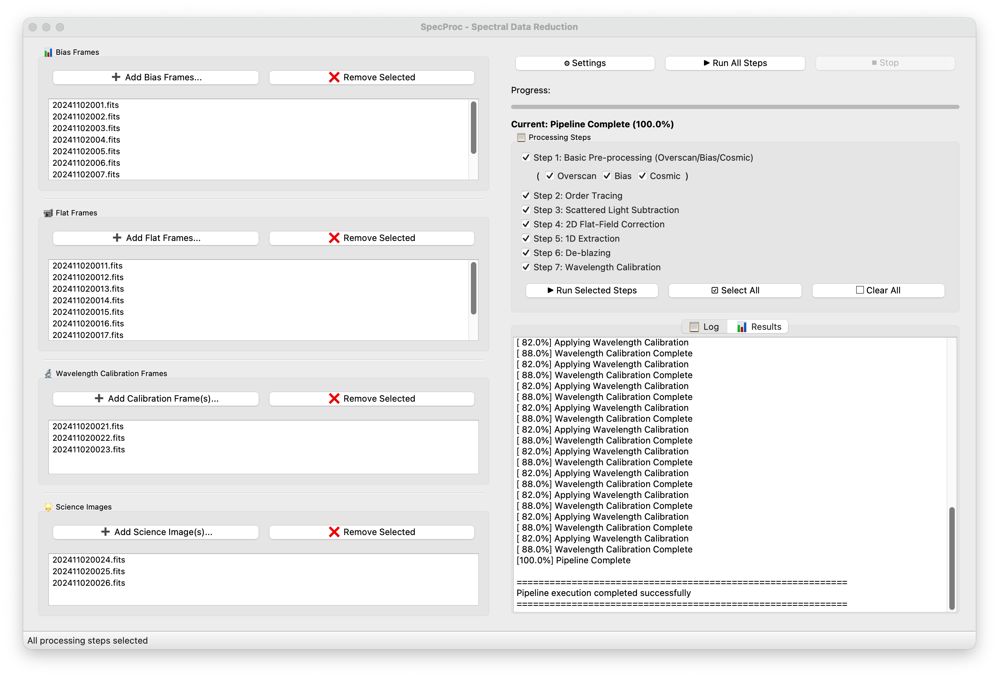

# SpecProc: PyQt GUI for Echelle Spectrograph FITS Data Reduction



A complete PyQt-based graphical interface for reducing echelle spectrograph FITS data.

## Table of Contents

- [Features](#features)
- [Installation](#installation)
- [Quick Start](#quick-start)
- [Configuration](#configuration)
- [Processing Pipeline](#processing-pipeline)
- [Usage](#usage)
- [Calibration Data](#calibration-data)
- [Troubleshooting](#troubleshooting)
- [Documentation](#documentation)

## Features

### Complete Reduction Pipeline

**8-stage automated spectral reduction**:

1. **Basic Pre-processing** - Overscan, bias subtraction, and cosmic ray correction
2. **Orders Tracing** - Master flat generation and echelle order tracing
3. **Scattered Light Subtraction** - Inter-order background modeling and removal (astropy convolution or spline)
4. **2D Flat-Field Correction** - 2D pixel flat correction
5. **1D Spectrum Extraction** - 1D spectrum extraction (sum or optimal)
6. **De-blazing** - Blaze function correction
7. **Wavelength Calibration** - Wavelength calibration applied to both sum and optimal de-blazed 1D spectra
8. **Order Stitching** - Merge overlapping neighboring orders into a continuous 1D spectrum

### Interactive GUI

PyQt5-based user interface with:
- File management for bias, flat, and science frames
- Real-time progress tracking
- Processing logs and diagnostics
- One-click pipeline execution or step-by-step processing

### Key Features

- **Configuration-Driven**: INI-format configuration files for easy parameter adjustment
- **Generic Spectrograph Support**: Configurable for different echelle spectrographs
- **Flexible Output**: Control which intermediate results to save
- **Command Line Interface**: Alternative to GUI for batch processing

## Installation

Choose one of the following installation methods:

### Method 1: Using pip

Install SpecProc directly from PyPI.

```bash
# Install SpecProc
pip install specproc

# Launch application
specproc
```

**Notes:**
- Requires Python 3.7+
- Dependencies will be automatically installed from PyPI
- Installation is permanent; uninstall with `pip uninstall specproc`

### Method 2: Using conda

Conda provides a complete environment with all dependencies. Two installation options:

#### Option 2.1: Install in existing conda environment

```bash
# Activate your conda environment
conda activate your_environment

# Install SpecProc from conda-forge
conda install -c conda-forge specproc

# Launch application
specproc
```

#### Option 2.2: Create new conda environment

```bash
# Create new conda environment for SpecProc
conda create -n specproc python=3.8
conda activate specproc

# Install SpecProc and all dependencies
conda install -c conda-forge specproc

# Launch application
specproc
```

**Notes:**
- Recommended for users who want an isolated environment
- All dependencies are managed by conda
- Python 3.7-3.11 are supported

### Method 3: Installing from Source

Run the installation script to install SpecProc and all dependencies from local source.

```bash
# Navigate to SpecProc directory
cd /path/to/SpecProc

# Make the script executable (if needed)
chmod +x install.sh

# Run installation script
./install.sh

# Launch application
specproc
```

**Notes:**
- Installation script handles all dependencies automatically
- Detects available package manager (pip or conda)
- Installs SpecProc to your system
- Use this method for automated setup from local source

## Quick Start

### Working Directory Setup

**Important**: SpecProc should be run in your working directory, NOT in the source code directory.

### Correct Workflow

```bash
# 1. Create your working directory (e.g., for an observation project)
mkdir -p /myworkspace
cd /myworkspace

# 2. Create subdirectories for data processing
mkdir -p 20241102_hrs output

# 3. Copy/move FITS data files to 20241102_hrs directory
cp /somewhere/bias_*.fits ./20241102_hrs/
cp /somewhere/flat_*.fits ./20241102_hrs/
cp /somewhere/thar_*.fits ./20241102_hrs/
cp /somewhere/science_*.fits ./20241102_hrs/

# 4. Create user config file (optional)
cp /path/to/SpecProc/default_config.cfg ./specproc.cfg

# 5. Run SpecProc in your working directory
specproc --config ./specproc.cfg
```

### Directory Structure

**Working directory** (where you process data):
```
/myworkspace/                  # Your working directory
├── 20241102_hrs/              # Input FITS files
│   ├── bias_*.fits
│   ├── flat_*.fits
│   ├── thar_*.fits      # ThAr lamp spectrum
│   └── science_*.fits   # Science images
├── output/                    # Processing results (auto-created)
│   ├── step1_basic/            # Step 1: Basic pre-processing
│   │   ├── overscan_corrected/ # Overscan-corrected images and diagnostic plots
│   │   ├── bias_subtracted/    # Master bias and bias-corrected images
│   │   └── cosmic_corrected/   # Cosmic ray corrected science images (if enabled)
│   ├── step2_flat/             # Step 2: Master flat field, blaze profiles, and diagnostic plots
│   ├── step3_background/       # Step 3: Background model and diagnostic plots
│   ├── step5_extraction/       # Step 5: Extracted 1D spectra and diagnostic plots
│   ├── step6_deblazing/        # Step 6: De-blazed spectra and diagnostic plots (if saved)
│   └── step7_wavelength/       # Step 7: Final wavelength calibrated 1D spectra and plots
│   └── step8_stitching/        # Step 8: Final stitched continuous 1D spectra and plots
├── specproc.cfg              # User config file (optional)
└── ...
```

**Note**:
- ❌ Do NOT run `specproc` in SpecProc source directory (`/path/to/SpecProc`)
- ✅ Run `specproc` in your working directory
- ✅ `rawdata` and `output` will be created in your working directory

## Configuration

### Config File Types

#### Default Configuration

**Location**: `SpecProc/default_config.cfg`
**Purpose**: Provides default parameter values
**Modification**: Not recommended to modify directly

#### User Configuration

**Location**: `specproc.cfg` in working directory
**Purpose**: Override default configuration, customize parameters
**Priority**: User config > Default config

### Path Configuration

#### Data Paths

```ini
[data]
# Raw FITS data directory path
# Example: If running in /myworkspace/ and rawdata_path=20241102_hrs,
# data will be loaded from /myworkspace/20241102_hrs/
#
# Path behavior:
# - rawdata_path = /data/20241102_hrs  → Absolute path, loads from /data/20241102_hrs/
# - rawdata_path = ./20241102_hrs       → Relative path, loads from working_directory/20241102_hrs/
# - rawdata_path = 20241102_hrs         → Same as above, also relative to working directory
#   (e.g., if working in /myworkspace/, loads from /myworkspace/20241102_hrs/)
#
# Examples (assuming working directory is /myworkspace/):
#   rawdata_path = ./20241102_hrs      → Data from /myworkspace/20241102_hrs/
#   rawdata_path = 20241102_hrs        → Same as above, data from /myworkspace/20241102_hrs/
#   rawdata_path = /data/20241102_hrs  → Data from /data/20241102_hrs/
rawdata_path = ./20241102_hrs
```

#### Output Path

```ini
[reduce]
# Output directory path for all processing results
# Example: If running in /myworkspace/ and output=output,
# results will be saved in /myworkspace/output/
#
# Path behavior:
# - output_path = /data/output      → Absolute path, saves to /data/output/
# - output_path = ./output          → Relative path, saves to working_directory/output/
# - output_path = output            → Same as above, also relative to working directory
#   (e.g., if working in /myworkspace/, saves to /myworkspace/output/)
#
# Examples (assuming working directory is /myworkspace/):
#   output_path = ./output          → Results to /myworkspace/output/
#   output_path = output            → Same as above, results to /myworkspace/output/
#   output_path = /data/output      → Results to /data/output/
#
# Output directory structure:
# output/
#   ├── step1_basic/            # Step 1: Basic pre-processing
#   │   ├── overscan_corrected/ # Overscan-corrected images
#   │   ├── bias_subtracted/    # Master bias and bias-corrected images
#   │   └── cosmic_corrected/   # Cosmic ray corrected science images (if enabled)
#   ├── step2_flat/             # Step 2: Master flat field with blaze profiles
#   ├── step3_background/       # Step 3: Background model
#   ├── step5_extraction/       # Step 5: Extracted 1D spectra (pixel space)
#   ├── step6_deblazing/        # Step 6: De-blazed spectra (if saved)
#   └── step7_wavelength/       # Step 7: Final wavelength calibrated 1D spectra
output_path = output

#### Path Examples

```bash
# Assume working directory is /myworkspace/
cd /myworkspace/

# Config file (relative path example):
[data]
rawdata_path = ./20241102_hrs
[reduce]
output_path = ./output

# Actual paths used:
# Input:  /myworkspace/20241102_hrs/
# Output: /myworkspace/output/

# Config file (absolute path example):
[data]
rawdata_path = /data/20241102_hrs
[reduce]
output_path = /data/output

# Actual paths used:
# Input:  /data/20241102_hrs/
# Output: /data/output/
```

### Intermediate Results Saving

Control which processing steps to save intermediate results:

```ini
[reduce.save_intermediate]
# Whether to save intermediate results for each step
# Set to 'yes' or 'no' for each step independently
# Default is 'yes' for all steps
save_overscan = yes        # Step 1: Overscan correction (saves to output/step1_basic/overscan_corrected/)
save_bias = yes             # Step 1: Bias correction (saves to output/step1_basic/bias_subtracted/)
save_flat = yes              # Step 2: Flat fielding (saves master flat to output/step2_flat/)
save_background = yes        # Step 3: Background subtraction (saves model to output/step3_background/)
save_cosmic = yes           # Step 1: Cosmic ray correction (saves to output/step1_basic/cosmic_corrected/)
save_extraction = yes       # Step 5: Spectrum extraction (saves to output/step5_extraction/)
save_deblaze = yes          # Step 6: De-blazing (saves to output/step6_deblazing/)
save_wlcalib = yes          # Step 7: Wavelength calibration (saves solution to output/step7_wavelength/)
```

**Effect**:
- If a step is set to `no`, the corresponding output subdirectory will NOT be created
- Final spectra are always saved to `output/step8_final_spectra/` regardless of these settings
- Diagnostic plots can be saved in corresponding step subdirectories
- In GUI, there should be corresponding checkboxes to enable/disable saving
- Default: All steps save intermediate results

### Telescope and Calibration Configuration

```ini
[telescope]
# Telescope name for calibration lookup
name = xinglong216hrs

# Spectrograph instrument name
instrument = hrs

[telescope.linelist]
# Lamp linelist type
linelist_type = ThAr

# Path to linelist files
linelist_path = calib_data/linelists/

# Specific linelist file to use (optional)
# For Xinglong 2.16m HRS: thar-noao.dat is recommended
linelist_file = thar-noao.dat

# Use pre-identified calibration files (optional)
use_precomputed_calibration = yes
calibration_path = calib_data/telescopes/xinglong216hrs/

# Specific calibration file to use (optional)
# Use latest: wlcalib_20211123011_A.fits
calibration_file = wlcalib_20211123011_A.fits
```

## Processing Pipeline

### Stage Descriptions

#### STEP 1: Basic Pre-processing
- **Input**: Raw FITS files (bias, flat, ThAr, science)
- **Processing**:
  - Extract overscan region (readout bias area)
  - Calculate median or polynomial fit
  - Subtract overscan bias from image
  - Combine multiple bias frames (mean/median)
  - Generate master bias
  - Subtract master bias from science/flat/ThAr images
  - Detect and remove cosmic rays using L.A.Cosmic (science images only)
- **Output**: Pre-processed images (overscan, bias, cosmic-ray corrected)
- **Note**: Fundamental corrections applied to prepare data for tracing and extraction.

#### STEP 2: Orders Tracing
- **Input**: Pre-processed flat frames
- **Processing**:
  - Combine flat frames
  - Generate master flat
  - Detect echelle orders
  - Fit polynomial traces for each order
  - Extract blaze profiles
- **Output**: Master flat, apertures, and blaze profiles
- **Note**: Provides apertures and blaze profiles for later stages

#### STEP 3: Scattered Light Subtraction
- **Input**: Pre-processed science image
- **Processing**:
  - Estimate background scattered light using 2D convolution or splines
  - Subtract background model from science image
- **Output**: Background subtracted image
- **Note**: Removes inter-order stray light.

#### STEP 4: 2D Flat-Field Correction
- **Input**: Background subtracted science image
- **Processing**:
  - Generate 2D pixel-to-pixel flat correction map
  - Apply 2D flat correction to science image
- **Output**: 2D Flat-fielded image
- **Note**: Corrects for pixel-to-pixel sensitivity variations.

#### STEP 5: 1D Spectrum Extraction
- **Input**: 2D Flat-fielded image
- **Processing**:
  - Extract 1D spectrum for each echelle order
  - Method: Sum extraction or Optimal extraction (Horne 1986)
  - Calculate extraction errors
- **Output**: SpectraSet (pixel space)
- **Note**: Converts 2D traces to 1D pixel space spectra.

#### STEP 6: De-blazing
- **Input**: Extracted 1D spectra (pixel space)
- **Processing**:
  - Read flat spectrum blaze function (in pixel space)
  - Match orders
  - Divide by blaze function: F_corrected(λ) = F_observed(λ) / B(λ)
  - Normalize to unit continuum
- **Output**: De-blazed spectra
- **Note**: Corrects for the blaze function of the spectrograph grating. Must be performed after wavelength calibration.

#### STEP 7: Wavelength Calibration
- **Input**: De-blazed 1D spectra (pixel space)
- **Processing**:
  - Step 1: Calibrate ThAr lamp spectrum
    - Extract 1D spectrum
    - Identify emission lines
    - Fit 2D wavelength polynomial: λ(x,y) = Σ p_ij·x^i·y^j
  - Step 2: Apply to science spectra
    - Convert pixel coordinates to wavelength units
- **Output**: Wavelength-calibrated 1D spectra
- **Note**: Establishes the physical wavelength scale for each order.


## Usage

### GUI Mode (Default)

```bash
# Launch GUI (default mode)
specproc

# Or explicitly specify GUI mode
specproc --mode gui

# With custom config file
specproc --config /path/to/config.cfg
```

**GUI Workflow**:
1. Select bias files
2. Select flat files
3. Select calibration files (ThAr lamp)
4. Select science files
5. Click "Run Full Pipeline" or execute stages step-by-step
6. View progress in real-time
7. Check results in output directory

### CLI Mode (Command Line)

```bash
# Run CLI mode
specproc --mode cli

# Or with custom config file
specproc --mode cli --config /path/to/config.cfg
```

**CLI Workflow**:
1. Follow prompts to select files
2. Select processing stages (0-7, or Enter for all)
3. Monitor console progress
4. Check results in output directory

## Calibration Data

### Directory Structure

```
calib_data/
├── linelists/              # Lamp emission line catalogs
│   ├── thar-noao.dat      # ThAr lamp lines (Xinglong 2.16m HRS recommended)
│   ├── thar.dat           # Standard ThAr lamp lines
│   ├── FeAr.dat           # FeAr lamp lines
└── ...
└── telescopes/             # Telescope-specific calibration files
    ├── generic/           # Generic configuration template
    └── xinglong216hrs/    # Xinglong 2.16m telescope
        ├── wlcalib_20141103049.fits
        ├── wlcalib_20171202012.fits
        ├── wlcalib_20190905028_A.fits
        └── wlcalib_20211123011_A.fits
```

### Lamp Line Lists

**Available linelist files**:
- `thar-noao.dat` - ThAr lamp lines (Xinglong 2.16m HRS recommended)
- `thar.dat` - Standard ThAr lamp lines
- `FeAr.dat` - FeAr lamp lines

**Supported lamp types**:
- `ThAr` - Thorium-Argon (most common for echelle spectrographs)
- `FeAr` - Iron-Argon
- `Ar` - Argon
- `Ne` - Neon
- `He` - Helium
- `Fe` - Iron

### Telescope Calibrations

**Available calibration files for Xinglong 2.16m HRS**:
- `wlcalib_20141103049.fits` - 2014-11-03 04:50
- `wlcalib_20171202012.fits` - 2017-12-02 01:20
- `wlcalib_20190905028_A.fits` - 2019-09-05 02:50 (version A)
- `wlcalib_20211123011_A.fits` - 2021-11-23 01:10 (version A) - **Latest**

### Configuration

```ini
[telescope]
name = xinglong216hrs
instrument = hrs

[telescope.linelist]
linelist_type = ThAr
linelist_path = calib_data/linelists/
linelist_file = thar-noao.dat
use_precomputed_calibration = yes
calibration_path = calib_data/telescopes/xinglong216hrs/
calibration_file = wlcalib_20211123011_A.fits
```

## Troubleshooting

### ImportError: No module named 'PyQt5'

```bash
# Install PyQt5
pip install PyQt5
```

### specproc command not found

```bash
conda activate specproc
pip install -e .
```

### Configuration file not found

```bash
# Copy default config
cp /path/to/SpecProc/default_config.cfg ./specproc.cfg
```

### Large file errors on GitHub

**Error**: `File exceeds GitHub's file size limit of 100.00 MB`

**Solution**: Large FITS files should not be committed. Use `.gitignore` to exclude them.

**Prevent future additions**:
- Add output directories to `.gitignore`
- Run SpecProc in separate working directory, not in source directory

## Documentation

- See [calib_data/README.md](calib_data/README.md) for calibration data configuration
- See [README_CN.md](README_CN.md) for Chinese documentation
- See [PIPELINE_FLOWCHART.md](PIPELINE_FLOWCHART.md) for detailed processing workflow

## Project Structure

```
SpecProc/
├── README.md                    # Main documentation
├── README_CN.md                # Main documentation (Chinese)
├── default_config.cfg           # Default configuration
├── specproc.cfg.example         # Example user configuration
├── install.sh                   # Installation script
├── requirements.txt              # Python dependencies
├── run.py                      # Main entry point
├── setup.py                     # Installation configuration
├── LICENSE                      # License
├── .gitignore                  # Git ignore rules
├── calib_data/                 # Calibration data
│   ├── README.md
│   ├── linelists/
│   └── telescopes/
├── src/                         # Source code
│   ├── gui/                     # GUI modules
│   ├── core/                    # Core processing
│   ├── config/                  # Configuration management
│   ├── utils/                   # Utility functions
│   └── plotting/                # Plotting functions
└── test_*.py                    # Test files
```

## License

See LICENSE file for details.

## Contributing

Contributions are welcome! Please feel free to submit a Pull Request.

## Acknowledgments

- Inspired by [gamse](https://github.com/wangleon/gamse) package
- Built with PyQt5, NumPy, SciPy and Astropy

## Support

For issues and questions, please open an issue on GitHub.
