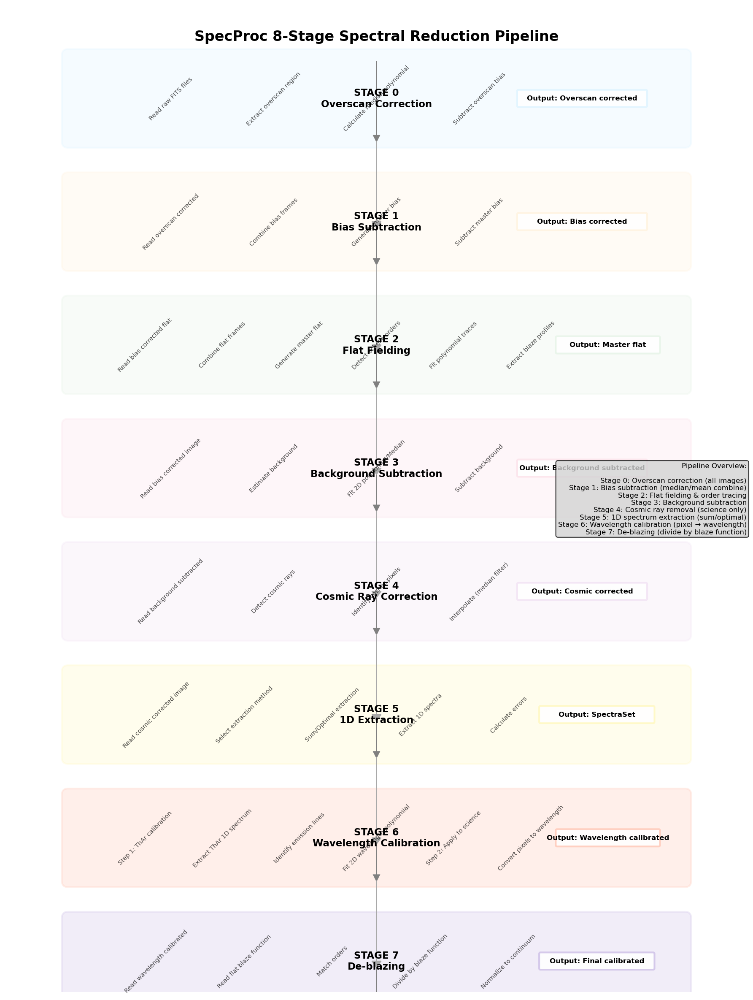

# SpecProc: 光谱数据处理图形界面工具

一个完整的基于 PyQt 的图形界面工具，用于处理阶梯光谱仪的 FITS 数据。

## 目录

- [功能特性](#功能特性)
- [安装](#安装)
- [快速开始](#快速开始)
- [配置](#配置)
- [处理流程](#处理流程)
- [使用方法](#使用方法)
- [校准数据](#校准数据)
- [常见问题](#常见问题)
- [文档](#文档)

## 功能特性

### 完整的处理流程

**8 阶段自动化光谱处理**：

1. **基础预处理 (Basic Pre-processing)** - 过扫描、本底扣除和宇宙线校正
2. **阶序追踪 (Orders Tracing)** - 生成主平场和阶梯光栅阶序追踪
3. **散射光扣除 (Scattered Light Subtraction)** - 阶序间背景建膜与扣除
4. **二维平场校正 (2D Flat-Field Correction)** - 像素到像素的平场校正
5. **一维光谱提取 (1D Spectrum Extraction)** - 提取一维光谱（求和或最优提取）
6. **闪耀函数改正 (De-blazing)** - Blaze 函数校正
7. **波长定标 (Wavelength Calibration)** - 波长定标（应用于去 Blaze 后的光谱）
8. **阶序拼接 (Order Stitching)** - 合并重叠的阶序为连续的一维光谱

### 图形界面

基于 PyQt5 的用户界面，支持：
- bias、flat、science 图像文件管理
- 实时进度跟踪
- 处理日志和诊断
- 一键执行完整流程或分步执行

### 主要特性

- **配置驱动**：使用 INI 格式配置文件，易于参数调整
- **通用光谱仪支持**：可配置不同的阶梯光谱仪
- **灵活输出**：控制是否保存每一步的中间结果
- **命令行界面**：除 GUI 外，还支持 CLI 批处理

## 安装

选择以下任一安装方法：

### 方法 1：使用 pip

从 PyPI 直接安装 SpecProc。

```bash
# 安装 SpecProc
pip install specproc

# 启动应用程序
specproc
```

**说明：**
- 需要 Python 3.7+
- 依赖包会自动从 PyPI 安装
- 卸载使用 `pip uninstall specproc`

### 方法 2：使用 conda

Conda 提供完整的环境和所有依赖。有两种安装选项：

#### 选项 2.1：在已有的 conda 环境中安装

```bash
# 激活你的 conda 环境
conda activate your_environment

# 从 conda-forge 安装 SpecProc
conda install -c conda-forge specproc

# 启动应用程序
specproc
```

#### 选项 2.2：创建新的 conda 环境

```bash
# 为 SpecProc 创建新的 conda 环境
conda create -n specproc python=3.8
conda activate specproc

# 安装 SpecProc 和所有依赖
conda install -c conda-forge specproc

# 启动应用程序
specproc
```

**说明：**
- 推荐给希望使用独立环境的用户
- 所有依赖由 conda 管理
- 支持 Python 3.7-3.11

### 方法 3：从源代码安装

运行安装脚本从本地源代码安装 SpecProc 和所有依赖。

```bash
# 进入 SpecProc 目录
cd /path/to/SpecProc

# 添加可执行权限（如需要）
chmod +x install.sh

# 运行安装脚本
./install.sh

# 启动应用程序
specproc
```

**说明：**
- 安装脚本自动处理所有依赖
- 自动检测可用的包管理器（pip 或 conda）
- 将 SpecProc 安装到你的系统
- 适用于从本地源代码进行自动化安装

## 快速开始

### 工作目录设置

**重要**：SpecProc 应该在你的工作目录中运行，而不是在源代码目录中运行。

### 正确的使用流程

```bash
# 1. 创建工作目录（用于观测项目）
mkdir -p /myworkspace
cd /myworkspace

# 2. 创建数据处理所需的子目录
mkdir -p 20241102_hrs output

# 3. 将 FITS 数据文件放到 20241102_hrs 目录
cp /somewhere/bias_*.fits ./20241102_hrs/
cp /somewhere/flat_*.fits ./20241102_hrs/
cp /somewhere/thar_*.fits ./20241102_hrs/
cp /somewhere/science_*.fits ./20241102_hrs/

# 4. 创建用户配置文件（可选）
cp /path/to/SpecProc/default_config.cfg ./specproc.cfg

# 5. 在工作目录中运行 SpecProc
specproc --config ./specproc.cfg
```

### 目录结构

**工作目录**（你处理数据的地方）：
```
/myworkspace/                  # 你的工作目录
├── 20241102_hrs/              # 原始 FITS 数据
│   ├── bias_*.fits
│   ├── flat_*.fits
│   ├── thar_*.fits      # ThAr 灯谱
│   └── science_*.fits   # 科学图像
├── output/                    # 处理结果（自动生成）
│   ├── step1_basic/            # 第1步：基础预处理
│   │   ├── overscan_corrected/ # 过扫描校正后的图像和诊断图
│   │   ├── bias_subtracted/    # 主偏置帧和偏置减除后的图像
│   │   └── cosmic_corrected/   # 宇宙线校正后的科学图像（如启用）
│   ├── step2_flat/             # 第2步：主平场、Blaze 轮廓和诊断图
│   ├── step3_background/       # 第3步：背景模型和诊断图
│   ├── step5_extraction/       # 第5步：提取的一维光谱和诊断图
│   ├── step6_wavelength/       # 第6步：波长定标解和诊断图
│   ├── step7_deblazing/        # 第7步：去 Blaze 的光谱和诊断图（如保存）
│   └── step8_final_spectra/    # 第8步：科学帧的最终一维光谱和诊断图
├── specproc.cfg              # 用户配置文件（可选）
└── ...
```

**注意**：
- ❌ 不要在 SpecProc 源代码目录（`/path/to/SpecProc`）中运行
- ✅ 在你的工作目录中运行 `specproc`
- ✅ `rawdata` 和 `output` 会在你的工作目录中自动创建

## 配置

### 配置文件类型

#### 默认配置文件

**位置**：`SpecProc/default_config.cfg`
**用途**：提供默认参数值
**修改**：不建议直接修改

#### 用户配置文件

**位置**：工作目录中的 `specproc.cfg`
**用途**：覆盖默认配置，自定义参数
**优先级**：用户配置 > 默认配置

### 路径配置

#### 数据路径

```ini
[data]
# 原始数据目录路径
# 例如：在 /myworkspace/ 目录运行 specproc
#
# 路径行为：
# - rawdata_path = /data/20241102_hrs  → 绝对路径，从 /data/20241102_hrs/ 加载数据
# - rawdata_path = ./20241102_hrs       → 相对路径，从工作目录/20241102_hrs/ 加载数据
#   （例如：在 /myworkspace/ 目录下运行，则从 /myworkspace/20241102_hrs/ 加载）
#
# 示例（假设工作目录是 /myworkspace/）：
#   rawdata_path = ./20241102_hrs      → 数据从 /myworkspace/20241102_hrs/ 加载
#   rawdata_path = /data/20241102_hrs   → 数据从 /data/20241102_hrs/ 加载
rawdata_path = ./20241102_hrs
```

#### 输出路径

```ini
[reduce]
# 输出目录路径（所有处理结果）
# 例如：在 /myworkspace/ 目录运行 specproc
#
# 路径行为：
# - output_path = /data/output  → 绝对路径，结果保存到 /data/output/
# - output_path = ./output      → 相对路径，结果保存到工作目录/output/
#   （例如：在 /myworkspace/ 目录下运行，则保存到 /myworkspace/output/）
#
# 示例（假设工作目录是 /myworkspace/）：
#   output_path = ./output        → 结果保存到 /myworkspace/output/
#   output_path = /data/output    → 结果保存到 /data/output/
#
# 输出目录结构（对应 9 个处理步骤）：
# output/
#   ├── step0_overscan/         # 第0步：过扫描校正后的图像和诊断图
#   ├── step1_bias/             # 第1步：主偏置帧和诊断图
#   ├── step2_flat/             # 第2步：主平场、Blaze 轮廓和诊断图
#   ├── step3_background/       # 第3步：背景模型和诊断图
#   ├── step4_cosmic/           # 第4步：宇宙线校正后的图像和诊断图（如启用）
#   ├── step5_extraction/       # 第5步：提取的一维光谱和诊断图
#   ├── step6_wavelength/       # 第6步：波长定标解和诊断图
#   ├── step7_deblazing/        # 第7步：去 Blaze 的光谱和诊断图（如保存）
#   └── step8_final_spectra/    # 第8步：科学帧的最终一维光谱和诊断图
output_path = output
```

#### 路径示例

```bash
# 假设工作目录是 /myworkspace/
cd /myworkspace/

# 配置文件（相对路径示例）：
[data]
rawdata_path = ./20241102_hrs
[reduce]
output_path = ./output

# 实际使用的路径：
# 输入：/myworkspace/20241102_hrs/
# 输出：/myworkspace/output/

# 配置文件（绝对路径示例）：
[data]
rawdata_path = /data/20241102_hrs
[reduce]
output_path = /data/output

# 实际使用的路径：
# 输入：/data/20241102_hrs/
# 输出：/data/output/
```

### 中间结果保存

控制每一步是否保存中间结果：

```ini
[reduce.save_intermediate]
# 每一步是否保存中间结果
# 可以单独控制每一步是否保存
# 默认所有步骤都保存
save_overscan = yes        # 第0步：过扫描校正（保存到 output/step0_overscan/）
save_bias = yes             # 第1步：偏置减除（保存主偏置帧到 output/step1_bias/）
save_flat = yes              # 第2步：平场改正（保存主平场到 output/step2_flat/）
save_background = yes        # 第3步：背景扣除（保存背景模型到 output/step3_background/）
save_cosmic = yes           # 第4步：宇宙线去除（保存校正后的图像到 output/step4_cosmic/）
save_extraction = yes       # 第5步：一维谱提取（保存到 output/step5_extraction/）
save_wlcalib = yes          # 第6步：波长定标（保存定标解到 output/step6_wavelength/）
save_deblaze = yes          # 第7步：Blaze 函数改正（保存到 output/step7_deblazing/）
```

**效果**：
- 如果某一步设置为 `no`，则不会创建对应的输出子目录
- 最终光谱总是保存到 `output/step8_final_spectra/`，不受这些设置影响
- 诊断图表可以保存到对应的步骤子目录中
- 在 GUI 中应该有对应的取消勾选选项
- 默认所有步骤都保存

### 望远镜和校准配置

```ini
[telescope]
# 望远镜名称（用于查找校准数据）
name = xinglong216hrs

# 光谱仪名称（用于校准文件查找）
instrument = hrs

[telescope.linelist]
# 灯谱线类型
linelist_type = ThAr

# 灯谱线文件路径
linelist_path = calib_data/linelists/

# 使用的具体灯谱线文件（可选）
# 对于兴隆216 HRS：thar-noao.dat 是推荐的
linelist_file = thar-noao.dat

# 是否使用预先识别的校准文件（可选）
use_precomputed_calibration = yes
calibration_path = calib_data/telescopes/xinglong216hrs/

# 使用的具体校准文件（可选）
# 使用最新的：wlcalib_20211123011_A.fits
calibration_file = wlcalib_20211123011_A.fits
```

## 处理流程

### 完整的 8 阶段处理流程



*图：SpecProc 8 阶段光谱还原处理流程*

### 阶段说明

#### 第1步：基础预处理 (Basic Pre-processing)
- **输入**：原始 FITS 文件（bias, flat, ThAr, science）
- **处理**：
  - 提取 overscan 区域（读出偏置区域）
  - 计算中值或多项式拟合
  - 从图像减去 overscan 偏置
  - 合并多个 bias 帧（均值/中值）
  - 生成 master bias
  - 从 science/flat/ThAr 减去 master bias
  - 使用 L.A.Cosmic 算法检测并去除宇宙线（仅限科学图像）
- **输出**：完成预处理的图像
- **说明**：在追踪和提取之前的基本物理校正。

#### 第2步：阶序追踪 (Orders Tracing)
- **输入**：预处理后的平场图像
- **处理**：
  - 合并平场图像
  - 生成 master flat
  - 检测阶梯阶序
  - 为每个阶序拟合多项式轨迹
  - 提取 blaze 函数
- **输出**：Master flat、阶序和 blaze 函数
- **说明**：为后续步骤提供阶序和 blaze 函数

#### 第3步：散射光扣除 (Scattered Light Subtraction)
- **输入**：预处理后的科学图像
- **处理**：
  - 使用 2D 多项式或中值滤波估计背景
  - 从图像减去背景
  - 扣除级次间的散射光
- **输出**：去除了散射光背景的图像
- **说明**：消除级次间杂散光干扰。

#### 第4步：2D平场校正 (2D Flat-Field Correction)
- **输入**：背景扣除后的图像
- **处理**：
  - 生成 2D 像素平场校正图
  - 将 2D 平场校正应用到科学图像
- **输出**：2D 平场校正后的图像
- **说明**：校正 CCD 像素响应不均匀性。

#### 第5步：一维谱提取 (1D Spectrum Extraction)
- **输入**：2D平场校正后的图像
- **处理**：
  - 为每个阶梯阶序提取 1D 光谱
  - 方法：求和提取或最优提取（Horne 1986）
  - 计算提取误差
- **输出**：像素空间的一维光谱
- **说明**：将 2D 弯曲的光谱信号提取为一维数组。

#### 第6步：闪耀函数改正 (De-blazing)
- **输入**：像素空间的一维光谱
- **处理**：
  - 从平场读取 blaze 函数（在像素空间）
  - 匹配阶序
  - 除以 blaze 函数：F_corrected(λ) = F_observed(λ) / B(λ)
  - 归一化到单位连续谱
- **输出**：经闪耀函数校正的光谱
- **说明**：消除光谱仪光栅衍射效率分布的影响。

#### 第7步：波长定标 (Wavelength Calibration)
- **输入**：经闪耀函数校正的一维光谱（像素空间）
- **处理**：
  - 第一步：定标 ThAr 灯谱
    - 提取 1D 光谱
    - 识别发射谱线
    - 拟合 2D 波长多项式 λ(x,y) = Σ p_ij·x^i·y^j
  - 第二步：应用到科学光谱
    - 将像素坐标转换为波长单位
- **输出**：带波长信息的一维光谱 (wavelength space)
- **说明**：为去 Blaze 后的光谱建立物理波长刻度。

#### 第8步：阶序拼接 (Order Stitching)
- **输入**：带波长信息的一维光谱
- **处理**：
  - 将重叠的相邻级次拼接
  - 在重叠区域根据信噪比进行加权合并
- **输出**：最终连续的一维光谱
- **说明**：生成可供最终科学分析的光谱数据。

## 使用方法

### GUI 模式（默认）

```bash
# 启动 GUI（默认模式）
specproc

# 或显式指定 GUI 模式
specproc --mode gui

# 使用自定义配置文件
specproc --config /path/to/config.cfg
```

**GUI 工作流程**：
1. 选择 bias 文件
2. 选择 flat 文件
3. 选择校准文件（ThAr 灯谱）
4. 选择 science 文件
5. 点击"运行完整流程"或分步执行
6. 实时查看进度
7. 在 output 目录查看结果

### CLI 模式（命令行）

```bash
# 运行 CLI 模式
specproc --mode cli

# 使用自定义配置
specproc --mode cli --config /path/to/config.cfg
```

**CLI 工作流程**：
1. 按提示选择文件
2. 选择处理步骤（0-7，或回车执行全部）
3. 监控控制台进度
4. 在 output 目录查看结果

## 校准数据

### 目录结构

```
calib_data/
├── linelists/              # 灯谱发射线目录
│   ├── thar-noao.dat      # ThAr 灯谱线（兴隆216 HRS 推荐）
│   ├── thar.dat           # 标准 ThAr 灯谱线
│   └── FeAr.dat           # FeAr 灯谱线
└── telescopes/             # 望远镜特定校准文件
    ├── generic/           # 通用配置模板
    └── xinglong216hrs/    # 兴隆216望远镜
        ├── wlcalib_20141103049.fits
        ├── wlcalib_20171202012.fits
        ├── wlcalib_20190905028_A.fits
        └── wlcalib_20211123011_A.fits
```

### 灯谱线文件

**可用的灯谱线文件**：
- `thar-noao.dat` - ThAr 灯谱线（兴隆216 HRS 推荐）
- `thar.dat` - 标准 ThAr 灯谱线
- `FeAr.dat` - FeAr 灯谱线

**支持的灯类型**：
- `ThAr` - 氩钍灯（阶梯光谱仪最常用）
- `FeAr` - 铁氩灯
- `Ar` - 氩灯
- `Ne` - 氖灯
- `He` - 氦灯
- `Fe` - 铁灯

### 望远镜校准文件

**兴隆216 HRS 可用的校准文件**：
- `wlcalib_20141103049.fits` - 2014-11-03 04:50
- `wlcalib_20171202012.fits` - 2017-12-02 01:20
- `wlcalib_20190905028_A.fits` - 2019-09-05 02:50（版本 A）
- `wlcalib_20211123011_A.fits` - 2021-11-23 01:10（版本 A）- **最新**

### 使用选项

#### 使用预计算的校准文件（推荐）

```ini
use_precomputed_calibration = yes
calibration_file = wlcalib_20211123011_A.fits
```

#### 重新拟合波长定标

```ini
use_precomputed_calibration = no
linelist_file = thar-noao.dat
```

### 添加自定义校准数据

#### 添加新的灯谱线文件：

1. 在 `linelists/` 目录创建文件
2. 遵循文件格式（波长、强度、注释）
3. 在配置文件中配置：`linelist_file = <文件名>`

#### 添加新的望远镜：

1. 创建目录：`calib_data/telescopes/<望远镜名称>/`
2. 放置校准文件，使用正确的命名规则
3. 在配置文件中配置：
   ```ini
   [telescope]
   name = <望远镜名称>
   instrument = <光谱仪名称>
   ```

## 常见问题

### ImportError: No module named 'PyQt5'

```bash
conda activate specproc
pip install PyQt5
```

### specproc 命令找不到

```bash
conda activate specproc
pip install -e .
```

### 配置文件找不到

```bash
# 复制默认配置
cp /path/to/SpecProc/default_config.cfg ./specproc.cfg
```

### GitHub 大文件错误

**错误**：`File exceeds GitHub's file size limit of 100.00 MB`

**解决方案**：大 FITS 文件不应该提交。使用 `.gitignore` 排除它们。

**防止将来添加**：
- 在 `.gitignore` 中添加输出目录
- 在单独的工作目录运行 SpecProc，而不是在源代码目录

### 处理错误

1. **缺少 bias 文件**：Bias 校正是可选的，但推荐使用
2. **缺少 flat 文件**：阶序追踪需要
3. **缺少校准文件**：波长定标需要

## 文档

- 查看 [calib_data/README_CN.md](calib_data/README_CN.md) 了解校准数据配置
- 查看 [CONFIGURATION_GUIDE_CN.md](CONFIGURATION_GUIDE_CN.md) 了解详细配置指南
- 查看 [PIPELINE_FLOWCHART.md](PIPELINE_FLOWCHART.md) 了解详细处理流程

## 项目结构

```
SpecProc/
├── README.md                    # 主文档（英文）
├── README_CN.md                # 主文档（中文）
├── DOCUMENTATION.md             # 文档索引
├── INSTALLATION_GUIDE.md       # 安装指南（英文）
├── INSTALLATION_GUIDE_CN.md    # 安装指南（中文）
├── QUICK_START.md               # 快速开始（中文）
├── QUICK_REFERENCE.md           # 快速参考（英文）
├── CONFIGURATION_GUIDE_CN.md   # 配置指南（中文）
├── default_config.cfg           # 默认配置
├── specproc.cfg.example         # 用户配置示例
├── calib_data/
│   ├── README.md                # 校准数据指南（英文）
│   ├── README_CN.md            # 校准数据指南（中文）
│   ├── linelists/               # 灯谱线文件
│   └── telescopes/              # 望远镜校准文件
├── src/                         # 源代码
│   ├── gui/                     # GUI 模块
│   ├── core/                    # 核心处理
│   ├── config/                  # 配置管理
│   ├── utils/                   # 工具函数
│   └── plotting/                # 绘图功能
├── install.sh                   # 安装脚本
├── requirements.txt              # Python 依赖
├── setup.py                     # 安装配置
├── run.py                      # 主入口点
└── test_*.py                    # 测试文件
```

## 许可证

查看 LICENSE 文件了解详情。

## 贡献

欢迎贡献！请随时提交 Pull Request。

## 致谢

- 受 [gamse](https://github.com/wangleon/gamse) 包启发
- 使用 PyQt5、NumPy、SciPy 和 Astropy 构建

## 支持

如有问题和疑问，请在 GitHub 上提交 Issue。
