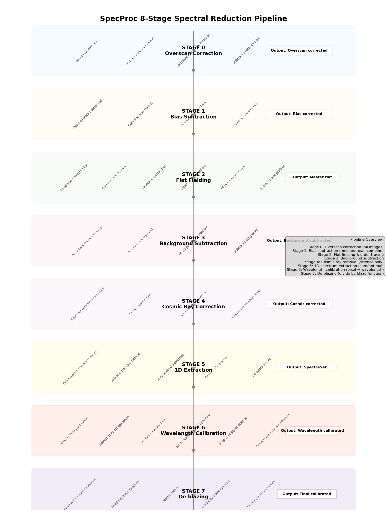
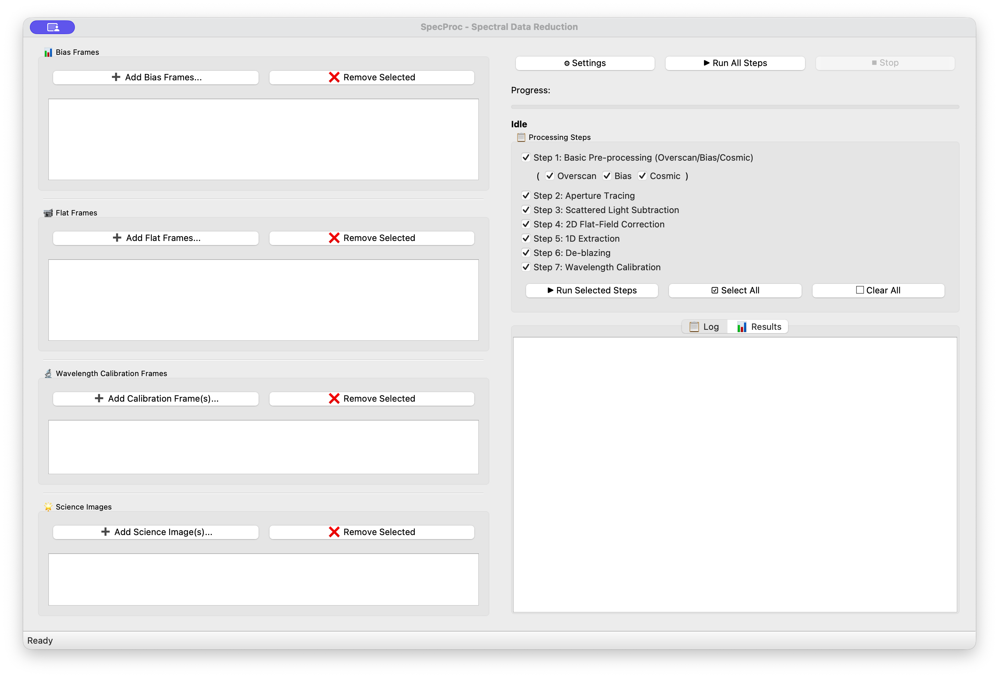
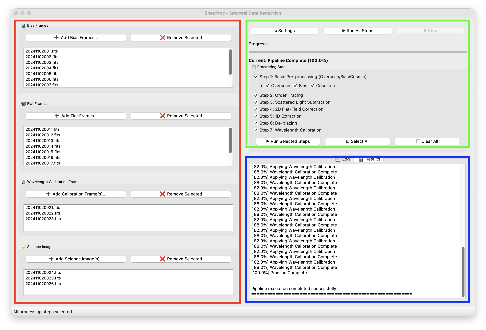

# SpecProc 操作手册

## **封面**

（请在此处设置页面居中）

<br><br><br><br>

**<font size="7">SpecProc</font>**

**<font size="6">操作手册</font>**

<br><br><br><br><br><br><br><br><br><br><br><br><br><br><br><br>

**（版本号不在此处显示）**

---

## **目录**

**[第一章：软件简介](#第一章-软件简介)**
*   [1.1 软件概述](#11-软件概述)
*   [1.2 主要功能特性](#12-主要功能特性)
*   [1.3 自动化处理流程](#13-自动化处理流程)
*   [1.4 软件验证与评测](#14-软件验证与评测)

**[第二章：安装与启动](#第二章-安装与启动)**
*   [2.1 运行环境要求](#21-运行环境要求)
*   [2.2 使用 Conda 安装 (推荐)](#22-使用-conda-安装-推荐)
*   [2.3 工作目录设置](#23-工作目录设置)
*   [2.4 启动软件](#24-启动软件)

**[第三章：主界面介绍](#第三章-主界面介绍)**
*   [3.1 界面概览](#31-界面概览)
*   [3.2 文件管理区](#32-文件管理区)
*   [3.3 处理流程控制区](#33-处理流程控制区)
*   [3.4 日志与状态区](#34-日志与状态区)

**[第四章：数据处理详细步骤](#第四章-数据处理详细步骤)**
*   [4.1 准备工作：加载数据](#41-准备工作加载数据)
*   [4.2 步骤一：基础预处理 (Basic Pre-processing)](#42-步骤一基础预处理-basic-pre-processing)
*   [4.3 步骤二：级次寻迹 (Orders Tracing)](#43-步骤二级次寻迹-orders-tracing)
*   [4.4 步骤三：散射光扣除 (Scattered Light Subtraction)](#44-步骤三散射光扣除-scattered-light-subtraction)
*   [4.5 步骤四：二维平场校正 (2D Flat-Field Correction)](#45-步骤四二维平场校正-2d-flat-field-correction)
*   [4.6 步骤五 & 六：一维提取与去闪耀 (Extraction & De-blazing)](#46-步骤五--六一维提取与去闪耀-extraction--de-blazing)
*   [4.7 步骤七：波长定标 (Wavelength Calibration)](#47-步骤七波长定标-wavelength-calibration)
*   [4.8 步骤八：级次拼接 (Order Stitching)](#48-步骤八级次拼接-order-stitching)

**[第五章：结果查看与输出](#第五章-结果查看与输出)**
*   [5.1 输出目录结构](#51-输出目录结构)
*   [5.2 诊断图与中间产物](#52-诊断图与中间产物)
*   [5.3 最终数据产品](#53-最终数据产品)

**[第六章：高级配置](#第六章-高级配置)**
*   [6.1 配置文件说明](#61-配置文件说明)
*   [6.2 常用参数详解](#62-常用参数详解)

**[第七章：常见问题 (FAQ)](#第七章-常见问题-faq)**

---

## **第一章：软件简介**

### **1.1 软件概述**

SpecProc 是一款功能强大、图形化、交互式的自动化光谱处理软件，专门用于处理阶梯光栅光谱仪（Echelle Spectrograph）生成的 FITS 格式数据。它旨在将天文学家从繁琐、重复的光谱数据处理流程中解放出来，通过一套经过充分验证的算法，实现从原始二维图像到一维定标光谱的全自动化处理。

### **1.2 主要功能特性**

*   **卓越的自动化流程**：用户仅需一次性导入全部原始数据，即可“一键执行”完成全部8个核心处理步骤，无需任何人工干预。
*   **交互式与批处理双模式**：提供操作直观的图形用户界面（GUI），支持分步调试与诊断；同时提供无图形界面的命令行模式（CLI），方便在服务器上进行大规模数据的批量处理。
*   **强大的容错与自适应能力**：针对寻迹断裂、宇宙线、干涉条纹、谱线盲配等常见难题，软件内置了自适应的容错与参数推算机制，确保了处理流水线的鲁棒性。
*   **过程“白盒”可追溯**：在高度自动化的同时，软件在每一步都会输出直观、详尽的诊断图与日志文件，保证了整个数据处理过程的科学严谨性与可回溯性。

### **1.3 自动化处理流程**

软件的核心处理流程遵循标准的阶梯光栅光谱数据处理逻辑，如下图所示。它将原始的二维 FITS 图像，经过一系列校准和计算，最终转换为可供科学分析的一维连续光谱。



### **1.4 软件验证与评测**

**SpecProc v1.0.0** 版本在真实的阶梯光栅观测数据集上进行了严格测试，结论表明该软件表现出了**卓越的自动化处理能力**。

*   **流程自动化验证**：无论是采用“分步执行”还是“一键全自动执行”，软件都能无缝串联所有处理步骤，自动完成数据在各阶段的流转，无需任何人工交互。
*   **结论**：测试结果表明，SpecProc 完全满足并超出了“实现自动化处理光谱数据”的设计指标，是一款成熟、可靠的光谱处理工具。

本手册后续章节的操作说明和预期结果，均基于官方测评报告中已成功验证的流程。

---

## **第二章：安装与启动**

### **2.1 运行环境要求**

*   **操作系统**：支持 Windows、macOS、Linux 等主流桌面操作系统。
*   **软件依赖**：需要 Python 3.6 或更高版本。
*   **官方测试环境**:
    *   **软件版本**: `SpecProc v1.0.0`
    *   **核心依赖**: `PyQt5`, `Numpy`, `Scipy`, `Astropy`, `Matplotlib`

### **2.2 使用 Conda 安装 (推荐)**

为了避免与其他 Python 项目的库冲突，强烈建议使用 Conda 创建一个独立的虚拟环境来运行 SpecProc。

1.  **创建并激活 Conda 环境**：
    ```bash
    conda create -n specproc python=3.8
    conda activate specproc
    ```
2.  **安装依赖库**：
    ```bash
    conda install -c conda-forge pyqt5 numpy scipy astropy matplotlib -y
    ```
3.  **安装 SpecProc**：
    进入 SpecProc 软件包的根目录，使用 `pip` 以可编辑模式进行安装。
    ```bash
    cd /path/to/SpecProc
    pip install -e .
    ```

### **2.3 工作目录设置**

**特别重要**：SpecProc 必须在您的数据工作目录下启动，而**不能**在其自身的代码目录下启动。规范的工作流如下：

1.  为您的观测数据创建一个专属的工作目录。
    ```bash
    mkdir /my/observation_data
    cd /my/observation_data
    ```
2.  在工作目录下，创建一个子目录（例如 `raw_data`）用来存放所有原始 FITS 文件。
    ```bash
    mkdir raw_data
    ```
3.  将您的 Bias、Flat、ThAr、Science 等 FITS 文件全部拷贝到 `raw_data` 目录中。
4.  （可选但推荐）从 SpecProc 源码包中拷贝默认配置文件到当前工作目录。
    ```bash
    cp /path/to/SpecProc/src/specproc/default_config.cfg ./specproc.cfg
    ```

### **2.4 启动软件**

确保已激活 `specproc` Conda 环境，且当前位于您的工作目录。执行以下命令即可启动图形界面：

```bash
specproc
```



---

## **第三章：主界面介绍**

### **3.1 界面概览**

主界面设计简洁，主要分为三大功能区域：左侧的 **文件管理区**，中间的 **处理流程控制区**，以及底部的 **日志与状态区**。



### **3.2 文件管理区**

位于界面左侧，用于加载和管理本次处理所需的所有 FITS 文件，包含 **Bias Frames**, **Flat Frames**, **Calib Frames**, **Science Frames** 四个列表。通过下方的“Add”和“Remove”按钮进行文件操作。

### **3.3 处理流程控制区**

位于界面中部，是软件的核心控制区域。
*   **处理步骤列表 (Processing Steps)**: 以复选框形式列出了全部8个处理步骤。
*   **控制按钮 (Control Buttons)**:
    *   **Run All Steps**: “一键”全自动执行所有步骤。测评报告已验证此功能可完全自动化运行。
    *   **Run Selected Steps**: 仅执行当前勾选的步骤。测评报告已验证此功能可保证数据链路完整。
    *   **Settings**: 打开参数配置对话框。

### **3.4 日志与状态区**

位于界面底部，提供实时信息反馈。
*   **状态栏 (Status Bar)**: 显示简短的当前状态。
*   **日志窗口 (Log Window)**: 详细输出每一步操作的日志、警告或错误信息。

---

## **第四章：数据处理详细步骤**

本章将详细介绍如何使用 SpecProc 完成一次完整的光谱数据处理。所有步骤的预期产出和诊断图均已在 `v1.0.0` 版本上通过真实数据得到验证。

### **4.1 准备工作：加载数据**

1.  启动软件。
2.  在左侧的**文件管理区**，分别点击“Add”按钮，加载您准备好的 Bias, Flat, Calib, 和 Science 图像。
3.  加载完成后，文件路径会显示在相应的列表框中。

### **4.2 参数设置 (可选)**

在执行任何处理步骤之前，您可以点击主界面中间的 **“Settings”** 按钮，打开参数配置对话框。虽然软件的默认参数对多数标准数据都有很好的效果，但了解并微调这些参数，能让您更好地应对特殊或低质量的数据。

这些参数与工作目录下的 `specproc.cfg` 文件内容相对应，修改后会自动保存。参数面板通常分为以下几个标签页：

#### **4.2.1 通用 (General) & 数据 (Data)**

*   `output_path`: 定义所有处理结果的输出总目录，默认为 `output`。
*   `overscan_start_column`: 设置过扫区的起始列。如果您的 FITS 数据不包含过扫区，请将此值设为 `-1` 以禁用该功能。
*   `detector_split_row`: 对于某些需要分开处理上下两部分的探测器（如兴隆2.16米高色散光谱仪），此处设置分割行数。

#### **4.2.2 平场 (Flat)**

*   `blaze_smooth_factor`: 闪耀函数（Blaze）B-Spline 拟合的平滑因子。值越大，拟合出的曲线越平滑、刚性越强；值越小，曲线越贴合局部的细节特征。
*   `fringe_orders`: 对于光谱红端容易出现干涉条纹的情况，指定需要用刚性多项式进行特殊处理的级次数。

#### **4.2.3 背景 (Background)**

*   `method`: 扣除散射光背景的方法。`convolution`（二维卷积）方法更普适，`column_spline`（按列样条拟合）则对某些特定条纹状背景有效。
*   `kernel_sigma_x` / `kernel_sigma_y`: 当使用 `convolution` 方法时，定义高斯卷积核在 X 和 Y 方向的大小，它决定了背景建模的平滑尺度。

#### **4.2.4 波长定标 (Wavelength Calibration)**

*   `rms_threshold`: 波长定标时，自动谱线匹配所允许的最大均方根（RMS）误差，单位为埃（Å）。如果灯谱信噪比较低或谱线较少导致定标失败，可以适当放宽此阈值（例如从 `0.5` 增大到 `0.8`）。

### **4.3 步骤一：基础预处理 (Basic Pre-processing)**

此步骤旨在完成对所有原始图像的探测器级效应校正。它被细分为三个子步骤，均完全自动化。

*   **操作**: 勾选 “1. Basic Pre-processing”，点击“Run Selected Steps”。
*   **执行过程与产出**:
    1.  **过扫区校正 (Overscan Correction)**: 软件自动提取过扫区，计算并扣除偏置。处理完成后，会在 `output/step1_basic/overscan_corrected/` 目录生成诊断图，展示过扫区轮廓的拟合效果。
        `[图片：过扫区改正诊断图，可参考测评报告图2]`
    2.  **本底扣除 (Bias Subtraction)**: 软件自动合并多帧 Bias 生成“主本底”(Master Bias)，并从其他所有图像中扣除。可在 `output/step1_basic/bias_subtracted/` 查看合成后的 Master Bias 图像。
        `[图片：合成后的 Master Bias 二维图像，可参考测评报告图3]`
    3.  **宇宙线去除 (Cosmic Ray Rejection)**: 软件自动调用 L.A.Cosmic 算法，识别并修复科学图像中的宇宙线。可在 `output/step1_basic/cosmic_corrected/` 中找到标记了已识别宇宙线的诊断图。
        `[图片：宇宙线剔除诊断图，红圈标记了被修复的宇宙线，可参考测评报告图4]`

### **4.4 步骤二：级次寻迹 (Orders Tracing)**

在平场图像上精确定位所有阶梯光栅的衍射级次。

*   **操作**: 勾选 “2. Orders Tracing”。
*   **结果**: 该步骤完成后，会在 `output/step2_trace/` 目录生成一张关键的诊断图，将自动识别并拟合的级次边界（通常为彩色曲线）叠加在主平场图像上，便于用户检查寻迹的准确性。
    `[图片：自动识别的光栅级次边界与中心寻迹诊断图，可参考测评报告图5]`

### **4.5 步骤三：散射光扣除 (Scattered Light Subtraction)**

扣除弥漫在探测器上的微弱背景光。

*   **操作**: 勾选 “3. Scattered Light Subtraction”。
*   **结果**: 在 `output/step3_scatterlight/` 目录中，您可以找到软件自动建立的二维背景模型图像，以及扣除背景后的科学图像。
    `[图片：自动生成的级次遮罩、背景模型及残差诊断图，可参考测评报告图6]`

### **4.6 步骤四：二维平场校正 (2D Flat-Field Correction)**

校正探测器像素之间的灵敏度差异。

*   **操作**: 勾选 “4. 2D Flat-Field Correction”。
*   **结果**: 此步骤会在 `output/step4_flat_corrected/` 目录生成用于校正的二维像素平场校正矩阵图像。
    `[图片：自动生成的二维像素平场校正矩阵，可参考测评报告图7]`

### **4.7 步骤五 & 六：一维提取与去闪耀 (Extraction & De-blazing)**

将二维光谱图像转换为一维光谱，并校正光栅闪耀效应。

*   **操作**: 勾选 “5. 1D Spectrum Extraction” 和 “6. De-blazing”。
*   **结果**: 软件会自动利用最优提取算法（Optimal Extraction）提取光谱，并拉平其包络。`output/step4_flat_corrected/` 中会生成所有级次的闪耀曲线概览图。
    `[图片：各级次闪耀曲线与一维提取包络概览图，可参考测评报告图8]`

### **4.8 步骤七：波长定标 (Wavelength Calibration)**

**这是 SpecProc 自动化程度极高的核心步骤之一**。它为一维光谱建立从“像素”到“波长”的精确转换关系。

*   **操作**: 勾选 “7. Wavelength Calibration”。
*   **执行过程**: 软件基于**盲配算法**，自动从灯谱中交叉认证上百条谱线，并自适应拟合二维色散曲面，整个过程无需人工指认谱线。
*   **结果**: 在 `output/step7_wavelength/` 中，会生成一张包含多窗口的详细诊断图，展示特征谱线的匹配情况、拟合残差（RMS）以及最终建立的二维波长色散曲面。极低的 RMS 残差证明了定标的高精度。
    `[图片：波长定标诊断图，展示谱线匹配、残差和二维色散面，可参考测评报告图9]`

### **4.9 步骤八：级次拼接 (Order Stitching)**

将所有独立的、已定标的级次拼接成一条完整、连续的一维光谱。

*   **操作**: 勾选 “8. Order Stitching”。
*   **结果**: 最终的科学级数据产品保存在 `output/step8_stitching/` 目录中。

---

## **第五章：结果查看与输出**

### **5.1 输出目录结构**

处理完成后，所有中间过程和最终结果都会保存在 `output` 目录中，其子目录结构清晰地对应了每一个处理步骤。

### **5.2 诊断图与中间产物**

每个 `stepX_...` 目录中的文件都是相应步骤的产物。这些文件（尤其是图片格式的诊断图）对于诊断处理过程中可能出现的问题至关重要。

### **5.3 最终数据产品**

您最关心的科学数据位于 `output/step8_stitching/` 目录中。这个文件（例如 `science_stitched.dat`）可以直接用于后续的科学分析。您可以使用 `matplotlib`、`gnuplot` 或 `TOPCAT` 等工具将其绘制出来。

`[图片：使用绘图软件绘制出的最终一维光谱，横轴为波长，纵轴为归一化流量]`

---

## **第六章：高级配置**

### **6.1 配置文件说明**

通过修改工作目录下的 `specproc.cfg` 文件，您可以精细地调整软件的处理行为。

### **6.2 常用参数详解**

*   `[data]` 部分:
    *   `overscan_start_column`: 设置过扫区的起始列。如果您的数据没有过扫区，请设为 `-1` 来禁用此功能。
*   `[reduce.flat]` 部分:
    *   `blaze_smooth_factor`: 闪耀函数拟合时的平滑因子，值越大，函数曲线越平滑。
*   `[reduce.background]` 部分:
    *   `method`: 散射光扣除的方法，可以是 `convolution` 或 `column_spline`。
*   `[reduce.wlcalib]` 部分:
    *   `rms_threshold`: 波长定标时，谱线匹配所允许的最大均方根（RMS）误差。如果定标失败，可以适当增大此值。

---

## **第七章：常见问题 (FAQ)**

1.  **问：软件启动时闪退或报错 “command not found”。**
    *   **答**：请检查：（1）您是否已在终端中通过 `conda activate specproc` 命令激活了正确的虚拟环境？（2）您是否已按照 `pip install -e .` 的方式正确安装了本软件？

2.  **问：级次寻迹失败或寻找到错误的级次。**
    *   **答**：通常是由于平场图像信噪比过低。请尝试使用更多帧平场进行合并。您也可以在 `specproc.cfg` 中调整寻迹相关的参数。

3.  **问：波长定标失败。**
    *   **答**：请检查：（1）加载的 Calib 灯谱是否正确？（2）灯谱的曝光是否适中，没有太多饱和的谱线？（3）尝试在配置文件中适当放宽 `rms_threshold` 的值。测评报告显示，本软件的盲配算法鲁棒性很强，失败概率较低。
